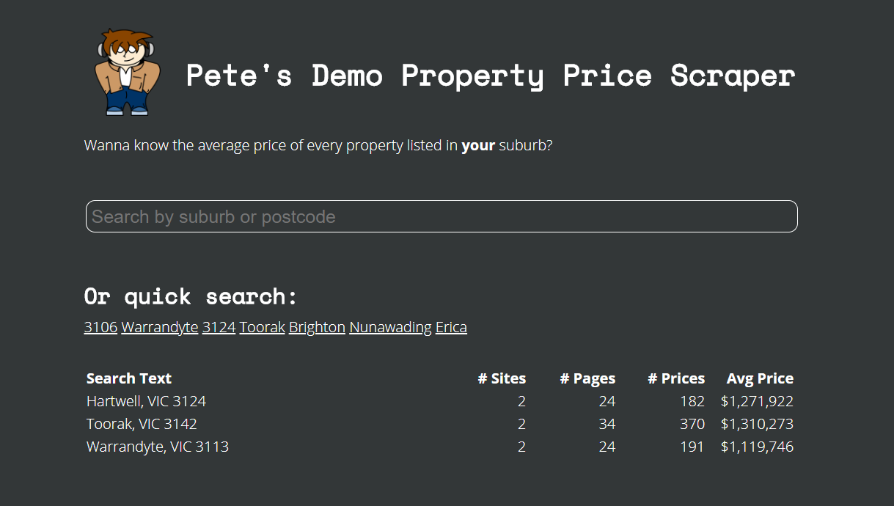

# Demo Golang Property Price Scraper
**Author:** Peter Eldred, June 2018

This project is a quick demo application pulled together to demo some of the Golang concurrency strengths by scraping Australian real estate websites for average suburb property prices.

# What does it do?
The application serves a single page on **localhost:8000**. The user is prompted to enter a search term of either a suburb or postcode. Upon submission of the search term, the application uses [Ferret](github.com/argusdusty/Ferret) to look up the most appropriate suburb, state and postcode match for the search criteria.

* The search is submitted to all of the real estate listing sites specified in the [config.json](config.json) file.
* Goroutines are used to scrape each of the listing sites in the shortest possible time
* Multiple searches can be asynchronously executed

# Project Dependancies
Be sure your go installation has these dependencies  before running:
* net/http
* github.com/gorilla/mux
* github.com/PuerkitoBio/goquery
* github.com/argusdusty/Ferret

# How to run
* **Install:** `go get github.com/dJPoida/pse_pp_scraper`
* **Update:** `go get -u github.com/dJPoida/pse_pp_scraper`
* **Run:** `go run main.go` from within the project path

# Configuration
You can update the [config.json](config.json) file to change various application configs and add/remove or enable/disable listing sites.

# Notes
* Some suburbs and postcodes will not work properly as the lookup is quite basic at the moment (i.e. searching for "Burwood" will yield a lookup value of "Burwood, NSW 1805" which is not ideal!)
* Only those prices that can be identified on the listing page and parsed into real numbers will be used in the average price calculation (i.e. listings that say "Contact Agent" are not included)

# Credits
* **Postcode Data** courtesy of [Geonames](http://www.geonames.org/)
